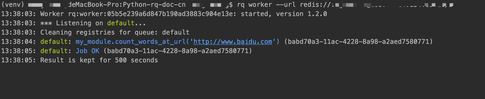

## 快速入门

## 安装
- Redis >= 3.0.0
- Python 2.7 或 Python >=3.4

直接用pip命令就可以安装最新的发布版本
```
pip install rq
```
如果想安装最新的版本(可能不稳定), 可使用以下命令
```
pip install -e git+git@github.com:nvie/rq.git@master#egg=rq
```


## 入门使用

> 首先得运行redis服务,然后任意定义一个耗时或者阻塞的函数，就像例子这样，
然后就可以把这个 job(我后面会翻译成任务) 压到待执行队列当中
```python
import requests

def count_words_at_url(url):
    resp = requests.get(url)
    return len(resp.text.split())
```

> 接着创建一个RQ队列
```python
from redis import Redis
from rq import Queue

q = Queue(connection=Redis())
```

> 然后用 enqueue 函数调用
```python
from my_module import count_words_at_url
result = q.enqueue(
             count_words_at_url, 'http://www.baidu.com')
            
```

用法本质就是这样的, 更多完整的例子请参考文档 [doc](https://python-rq.org/docs/)


## The Worker
后面我会翻译成rq 服务,不确定是否准确, 我也查阅过部分资料 
- https://bbs.csdn.net/topics/392084222
- [软件工程中英对照术语](https://people.ubuntu.com/~happyaron/l10n/%E8%BD%AF%E4%BB%B6%E5%B7%A5%E7%A8%8B%E4%B8%AD%E8%8B%B1%E5%AF%B9%E7%85%A7%E6%9C%AF%E8%AF%AD%E8%A1%A8-old.html)
> 在`项目目录中`启动 Worker，开始在后台执行 enqueued 中的函数

```
$ rq worker
*** Listening for work on default
Got count_words_at_url('http://nvie.com') from default
Job result = 818
*** Listening for work on default
```


> 可以明显看到已经访问了 www.baidu.com 这个网址, 说明 count_words_at_url 函数已经被执行了

测试代码见: https://github.com/wgPython/Python-rq-doc-cn/quickstart_main.py

